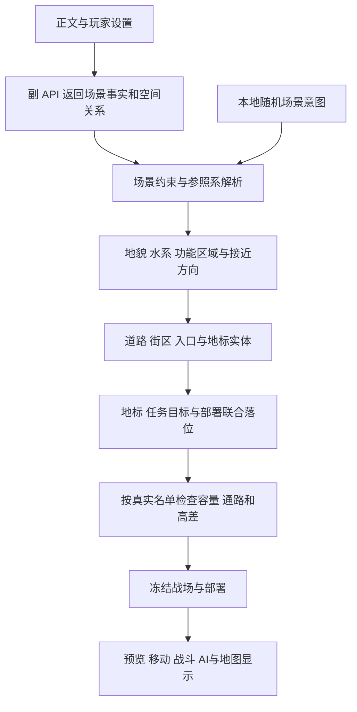

# 战场生成与正文空间关系重构方案

2026年9月30日，基于工作区 `a7db2b8` 制定。状态：首轮重构已落地；实际交付范围与验证记录见 [实施说明](battlefield-refactor-implementation.md)。下文的问题定位与阶段安排保留作为设计依据。

建议定向重构战场准备链：以正文中的场景事实为依据，统一安排地形、道路、地标、目标与部署，再由同一份战场数据驱动移动、战斗和显示。保留现有路网、城防结构、容量检查和存档体系，在它们之间补上空间关系与真实高度。

本方案同时处理四项需求：城市及其他地图更合理、更有辨识度；地标与部署符合交战情境；自然高地具有实际高差；使用副 API 时，地图与部署忠实落实正文。城市位置、城内外布局、攻守方向以及桥梁、城门等关键设施的数量与位置，都属于同一套空间约束。随机变化发生在正文未限定的细节中，明确的地点、阵营位置、通路数量和高低关系应稳定保留。

## 当前实现与已确认的问题

| 问题 | 当前代码及复现 | 对改造的意义 |
| --- | --- | --- |
| 城市有路网，但场所用途较少 | `layered-generator.ts:95` 已有城区、路网、矩形地块和城防；普通地块主要填充为建筑，默认城市地标偏向广场与建筑。`scene-layouts.ts` 的室内、建筑围攻和堑壕也各有固定的主骨架。 | 复用现有能力，补充街区用途、入口、院落及它们的关系，而非把现有代码误判为纯随机撒点。 |
| 有些锚点没有独立的空间含义 | `layered-generator.ts:273` 的位置计算没有分别落实 `center` 和 `riverbank`。本次固定种子中，7×13 地图几何中心是 D7，二者均落在 D4；最近水格距 D4 为4格。 | 锚点必须解析成实际区域，河岸必须查询真实水体边界。 |
| 地标找位置时可以跨区域移动 | `layered-generator.ts:293` 对不合法的初始位置搜索全图最近合法格，没有语义区域限制或最大偏移预算。 | 需要限定候选区域，并记录请求位置与实际位置的差异。 |
| 地标与部署没有显式绑定 | `spatial.ts:237`、`:260` 按上下边缘、城内、城墙及兵种评分部署；`LandmarkPlan` 没有驻守、接近或争夺关系。本次5种地标锚点方案的双方部署完全相同。 | 先确定各方与地标的关系，再在允许区域中按兵种选格。地标影响通行时可能间接改变部署，不能据本样本声称所有地图部署都不变。 |
| 旧协议转换丢失阵营方向 | `llm-map-design.ts:110` 将 `ally_left` 和 `enemy_left` 都转换成 `front_left`，右侧同理。 | 必须保留原参照系和所属方，不能仅保留左右。 |
| 自然高地没有高度数据 | `layers.ts:55` 的遮挡高度不包含 `hill`；`spatial.ts:219` 仅区分固定的地面、平台和空中视点。实际探针中，插入山地后的遮挡高度仍为0。 | 自然海拔与站立表面需要进入同一套空间判定。 |
| 正文细节会在输入与协议中丢失 | `jev-context.ts:182` 每条消息只保留末尾6000字符；`battlefield-plan.ts` 的协议以枚举、粗锚点和地标名为主，没有正文出处、双方空间关系、唯一通路等表达。 | 同时调整正文取材和返回结构；仅强化提示词不能补足字段缺失。 |
| 城市落点与桥梁总数受固定流程主导 | `layered-generator.ts` 用守方相对纵深生成城区；水域常铺成一条横带。非浅滩水域会尝试两个随机桥位，并可能保留既有通路所需的跨河位置，桥梁地标还可物化桥格。协议没有统一的桥梁总数和关联岸区。 | 城市位置、城外区域、水系及全部过河点需要一起规划；地标应引用已有桥梁实体。 |
| 多样性指标不能完整证明体验差异 | `audit-layered-battlefields.ts:20` 的签名包含结构等级和耐久。本次同种子只改城防等级，几何相同但签名不同。`map-metrics.ts` 的通行指标主要按旧 `wall` 瓦片计算，地标距离只读取旧 `generation.landmark`。 | 需要统计真实几何、分层通行、部署后的路线和正文约束满足情况。 |

本次仅做了源码核查与小范围确定性探针。探针种子为 `map-plan-review-20260930`，脚本和结果保存在本地 `artifacts/map-plan-review-20260930/`。这些结果用于定位具体缺口，不代表全面平衡或浏览器验证。

当前地标底图和单位都引用实际格号，未在此次源码检查中确认独立的像素坐标错位。方案同时改进标签的指向和区域高亮，并将缩放、手机布局下的标记对齐列入视觉验收。

## 统一战场准备流程



地区和关键关系先确定，细小掩体最后填充。约束检查失败时，只在失败阶段进行有界的本地调整。重要地标、任务点和部队落位最终作为一个整体通过检查，避免各模块分别作出合理选择后，组合起来违反正文。

场景意图可以来自副 API，也可以来自本地抽样；两者使用同一生成入口。副 API 负责理解正文，本地负责离散格子的布局、寻路与验证。开战前仍以一次副 API 请求为默认，局部修复不额外请求模型。

## 副 API 与正文贴合

### 保留当前地点的有效证据

保留现有“已完成正文”和隐藏推理过滤。首先在用户设置的消息范围内整理段落，给段落分配稳定引用，再在预算内发送当前地点、交战关系和最新状态。避免单纯保留每条消息尾部：长文开头的地点说明、后半段的门桥状态变化，都可能是关键事实。

第一版可使用本地段落筛选，将最新消息、场景转换段、已出现地点名和位置关系相关段落优先纳入，再补充相邻段落；达到预算时报告哪些来源被截断。筛选并不保证覆盖所有有效事实，应以固定正文样例检查遗漏。默认不跨越用户选择的消息范围；扩展历史场景记忆若后续需要，应带来源及有效范围。

统一现有单位短 ID：正文中的人物、编队或守军角色必须绑定到本次合法参战单位或明确的阵营组。同名单位不能仅靠名字匹配，未能可靠匹配的角色保留为未解析项。

处理时间与语气：已经发生的“退到西侧高地”覆盖先前站位；“准备退守高地”是意图；回忆中的旧战场、否定句和假设不能直接成为本次地图事实。

### 返回事实和关系

新增有版本的场景意图协议，保留现有紧凑字段作为兼容输入。字段承担以下职责：

| 内容 | 示例 | 本地用途 |
| --- | --- | --- |
| 当前场所和形态 | 临河小镇、仓库内部、山口关隘 | 限定可用场景构造规则 |
| 重要实体 | 北门、石桥、西侧高台、庭院 | 生成带稳定 ID 的实际区域或结构 |
| 空间关系 | 桥跨河、门通主街、高地高于道路 | 约束实体之间的布局 |
| 部队与实体关系 | 守军驻守北岸桥头、我方从南侧林地接近 | 限定初始部署和任务方向 |
| 城市和城外位置 | 城在西侧、河在城东、交战发生于城南农田 | 决定城市轮廓、城内外占比和本场战区范围 |
| 数量与状态 | 唯一入口、两座桥、东门关闭、围墙已破 | 防止随机填充和修路改变正文事实，并区分全城总数与本战区数量 |
| 来源性质 | 正文明确、合理推断、布局补全 | 决定哪些关系不可被随机性覆盖 |
| 正文引用 | 消息 ID、段落 ID、短摘录 | 支持核对来源和显示设计依据 |

以下仅为拟议协议示例，不是当前已支持的返回格式：

```json
{
  "schema": "scene-intent-v1",
  "scene": "field",
  "archetype": "river_crossing",
  "entities": [
    { "id": "river", "kind": "river", "basis": "explicit", "sources": ["m12.p1"] },
    { "id": "bridge", "kind": "bridge", "basis": "explicit", "sources": ["m12.p1"] },
    { "id": "woods", "kind": "forest", "basis": "explicit", "sources": ["m12.p2"] }
  ],
  "relations": [
    { "subject": "bridge", "relation": "crosses", "object": "river", "basis": "explicit", "sources": ["m12.p1"] },
    { "subject": "ally", "relation": "approaches_from", "object": "woods", "basis": "explicit", "sources": ["m12.p2"] },
    { "subject": "enemy", "relation": "guards", "object": "bridge", "region": "north_bank", "basis": "explicit", "sources": ["m12.p2"] }
  ],
  "constraints": [
    { "kind": "crossing_count", "entity": "river", "value": 1, "basis": "explicit", "sources": ["m12.p1"] }
  ]
}
```

实体、关系、数量和引用都用有上限的结构。建议第一版支持最多12个主要空间实体、24条关系、5个命名地标；普通房屋和树木仍由本地填充。具体预算以请求长度样本校准，避免给每个格子生成正文依据。

正文明确的专名、位置、数量、状态和所属方形成硬约束；模型推断和布局补全是可调整偏好。允许把“仓库入口旁”落到相邻的合法格，不允许把它调整到街区另一端。正文明确空旷时，应允许没有额外命名地标，避免无条件“至少一个地标”迫使模型虚构重要地点。

优先级为：玩家明确锁定的本次设置和合法参战名单、当前正文事实、模型推断、本地随机偏好。硬约束之间冲突时返回具体冲突，不能悄悄牺牲其中一项；例如正文要求唯一石桥，而模板默认双桥，就应选择支持单桥的模板。

出处校验能证明引用真实存在，不能单独证明模型理解正确。语义正确性需要用人工标注的正文样例验收，不能把模型自报的“有依据”直接算作贴合度通过。

### 落位后再核对一次

本地生成器输出逐项结果，例如“北岸守军已部署至桥头”“唯一桥梁已保留”“坡地高度为2，街道高度为0”。预览可展开“正文依据、实际位置、补全内容”三项；日常界面使用自然语言，协议字段只出现在开发诊断中。

同一段正文换种子，应当改变未限定的巷道、杂物、地块大小，继续保留守军的桥头位置、双方岸别及桥梁数量。

## 地图逻辑与多样性

### 城市按场所用途组织

城市先建立自然边界和重要地点，再布置主街、支路和地块。普通地块分为住区、市场、仓储、庭院、防御设施等用途，每类规定建筑占地、入口、空地、道路接入和掩体位置。

例如，仓储区有沿道路布置的较大仓库和装卸空地；老城有不规则街巷、院落和小广场；滨河区沿岸形成道路，桥头衔接主街；山城的道路通过坡道连接台地，城墙沿可防守的边界延伸。

地标作为规划输入预留场地与入口。已有建筑可被认定为地标，但应保留建筑整体 ID、范围与可接近位置。`major` 根据地图尺寸和用途形成连续区域；目前“中心格再加至多两个邻格”的做法不足以稳定表达大型广场或高地。

连通修复应优先调整支路、入口或少量可替换地块，并记录变动。超过语义允许的修复预算就重选本地候选，避免不断拆建筑后失去街区形状。唯一桥、完整城墙、明确关闭的门等关系按场景检查，不能被通用的“全图两条通路”要求覆盖。

### 其他场景拥有独立的构造规则

| 地图家族 | 首批可选原型 | 主要玩法差异 |
| --- | --- | --- |
| 城市 | 老城街巷、市场街区、仓储街区、滨河桥头、山城台地、城门外缘 | 巷道密度、院落与广场、桥头控制、进城方向、纵深和高差 |
| 平原 | 农田道路、河谷渡口、缓丘营地 | 开阔火线、田埂掩体、道路与侧翼、局部高地 |
| 森林 | 林间道路、溪流密林、山脚林地 | 连续林冠、视线窗口、林缘与空地、绕行成本 |
| 山地 | 山口关隘、双岭谷地、台地斜坡 | 山脊、谷底、坡道数量、俯视区与背坡盲区 |
| 室内 | 住宅院落、仓库大厅、堡垒内部 | 房间邻接、通廊、门口、支撑结构和家具带 |
| 建筑围攻 | 庄园围墙、仓储院区、小型据点 | 外围接近带、院内道路、侧门与目标建筑 |
| 堑壕 | 单线阵地、纵深阵地、村落接合部 | 战斗壕、交通壕、支撑点、预备阵地和无人地带 |

这些是构造规则的入口，不是最终固定地图。每种原型再组合道路连接方式、区域面积、入口方向、地块形状、局部损毁及高差，保证实际路线和战术选择发生变化。

按地图尺寸控制信息量：小图优先表达一个主冲突与少量支撑空间，大图才能同时容纳多个街区。正文决定可选范围，随机性在范围内产生变化。小地图无法表示整座城市时，生成与本场战斗相关的局部切片，并在名称中明确地点。

## 城市位置与城内外攻防

把战斗任务、城市占地和双方部署分开表达。“城市在附近”“战斗发生在城外”“正在攻城”是三种不同信息。城外野战可以使用歼灭任务；攻城可以要求占领合法城内核心；城门争夺等新目标若后续加入，需要明确的胜利规则，不能只把旗帜画在门上。

### 先确定战区覆盖哪一部分城市

城市支持处于战区一侧、角落、中部，以及跨河分区等布局。用城市区域和城墙边界表达真实位置，攻守身份决定部署职责，不直接决定城市必须在哪几排。

| 布局 | 城市与城外关系 | 部署重点 |
| --- | --- | --- |
| 城门正面攻防 | 城区在一侧，外侧有接近带、道路和城门前沿 | 攻方集结与推进，守方门墙火力、内侧预备队和核心守备 |
| 城外野战 | 城墙或城镇只占边缘，主要棋盘是农田、郊区、道路或丘陵 | 双方位于实际城外战线，守方可出城迎击 |
| 临河攻城 | 河在城外、贴城侧或穿过城区，桥连接指定的岸区与道路 | 桥头守备、渡河接近、桥后纵深和城门之间的关系 |
| 侧翼攻城 | 城市偏一侧或角落，主攻来自侧方，其他边界由地形或城墙限制 | 主攻与牵制分别布阵，保持正文指定的方位 |
| 围城据点 | 完整或局部封闭城市在中部，外围有多个接近区 | 多方向攻方部署、守军内线机动、各门对应的防区 |
| 山城攻防 | 城市分布在台地或山腰，城外道路沿坡上行 | 坡口、梯道、制高点和背坡集结区 |

这些布局由正文或本地场景意图选择。尺寸不足时，优先缩小到与交战相关的城段，或按已有合法尺寸扩图。所有实际胜利目标必须仍位于图内且适用于该切片；不能裁掉攻城核心却继续要求占领图外目标。

城市内部保留主街、支巷、街区、庭院和核心的关系；城外也应拥有连贯用途：农田、村落、林缘、集结地、堤岸、壕沟、道路和高地。城外掩体沿田埂、道路边、废屋和阵地形成，接近路线连接到真实城门、破口或可攻墙段。

守军不应全部被固定在城墙或城内。正文写“出城列阵”时，部署在城外指定防区；写“扼守桥头”时，桥头就是前沿；写“退守内城”时，外墙可以空置。攻军同样需要按主攻、侧翼和预备队安排，主攻方向与可行接近路线一致。

### 统一桥梁和过河点的数量

将河流、护城河、桥梁、浅滩和城门建成带 ID 的实体及连接关系。河流有连续河道和两岸；护城河沿所选城防边界延伸；道路跨水时必须引用合法过河点。

桥梁独立记录数量、跨越哪条水系、连接哪两个岸区、附近道路或城门、宽度、完整状态和战术作用。数量以逻辑桥梁实体计数，一座跨越多格水面的桥仍算一座。命名地标引用该桥 ID，不额外生成第二座桥；移动或删除桥梁时也同步处理两岸接入。

| 约束 | 应落实的结果 |
| --- | --- |
| “唯一石桥位于东门外” | 本战区相应河段恰有1座桥，连接东门接近道路；通路修复不能另开第二桥或浅滩 |
| “南北各一座桥” | 两座不同桥梁分别连接对应岸区，不能落在相邻格后被当成两座 |
| “桥已断，守军控制北岸” | 保留断桥状态，守军部署在北岸；根据真实能力与任务检查可行行动 |
| “护城河有两处吊桥” | 两处过河点与各自城门衔接，开闭或毁坏状态分别记录；新结构机制须与现有门桥能力匹配 |
| “城中有三座桥，本次打西门外” | 区分全城背景数量与本次战区的实际数量，不能为了凑全城桥数把三座都塞到西门前 |

城门、初始破口、桥梁和浅滩分别计数，也共同决定可进入城区的路线。完整桥接闭门表示“能到门前、仍需处理城门”，不等同于直接进入城区。道路接到河边但没有桥或浅滩时，应明确是断路或码头等场景事实，不画成可通行道路。

数量未说明时，依据地貌、城市用途和所选战区有界抽样，允许0、1或多座；数量一旦确定，就对后续生成阶段冻结。自然河道的连通、水面宽度和两岸接入都参与校验，避免目标点保护或普通街区填充在水带中意外留下陆路。

桥毁、完整包围等状态可能使普通步行路线暂时中断。验证应区分步行可达、可开门、可破障、可攀登和需要真实航渡能力的路线；不能为了让测试连通而自动造桥或改变单位能力。若当前任务与名单确实无可行方案，应明确指出冲突，保留正文中的桥梁和城防状态。

首版的营地、攻城阵地和郊区设施主要承担区域、掩体与部署作用。攻城器械、吊桥升降或搭桥行动如果超出已有机制，作为单独能力扩展；有对应单位或结构规则后再产生战斗效果。

例如，正文写：“小城位于西侧，城东有河，东门外只有一座石桥。守军扼守西岸桥头，我方从东岸林地接近；北面高台可以俯瞰桥面。”生成结果应同时满足：城市在西，河在其东；石桥连接两岸并接入东门道路；守军在西岸桥头，我军在东岸林地接近区；北面高台具有真实海拔且能看到桥面。图内其他巷道和掩体可以变化，这几项关系跨种子保持。


示意图表达连接关系；最终格子图还要落实东西南北、区域距离、高差和合法站位。如果正文改成“守军已经出城到东岸”，只改变对应部署事实及其必要布局，不把部队强行搬回城墙。

## 地标与部署共同落位

地标需要区分实体范围、可接近格、可驻守格和显示位置。建筑的实体格可能不可通行，部队应部署在入口或庭院；塔楼的可驻守位置可能是平台。所有距离计算对准正确的可用位置。

给地标补充稳定 ID、所属区域及战术作用。给部署补充与该 ID 的关系，而不是靠名称里的“我方阵地”推断所属方。

| 战术作用 | 部署关系 | 建议初始距离约束 |
| --- | --- | --- |
| 已占据的阵地 | 对应部队在区域内或合法相邻接近格 | 正文明确“驻守其中”时为硬约束 |
| 己方出发点 | 主力在附近，先锋按实际能力前出 | 主要负责单位约0—1个正常移动回合可达 |
| 争夺点 | 双方从各自接近方向进入 | 同配置参考步兵通常1—3个移动回合，允许场景指定的偏置 |
| 敌方纵深目标 | 位于有效防线后方 | 先经过前沿；攻方不直接部署在核心旁 |
| 途中地标或背景 | 不强制吸附部队 | 检查与道路、河岸或区域的关系 |

表中回合范围是待校准的设计起点，不是适用于所有兵种和任务的硬标准。距离使用实际移动成本，并对承担任务的真实单位检查；同时用统一参考单位比较双方几何差异，避免快慢兵种掩盖地图本身的偏置。

部署先分配区域，再应用现有的近战前排、远程射界、容量和拥挤评分。纯软加分无法保证正文要求，因此“守军已在桥头”应进入候选区域限制；没有指定关系时继续使用现有默认布阵。

参照系必须显式区分：正文的东南西北、画面的左右、攻守双方的前后。统一在场景编译时转换一次；若为显示调整地图朝向，应显示方向指示。交换攻守方只重新解释相对角色，不误翻转正文中的绝对方向。

新增 `deploymentZones` 的同时，先锋前出、撤退出口、护送方向、AI前沿探针与提示文字也必须查询这些区域，避免新部署仍被旧的“最上三排、最下三排”规则拉回去。旧地图保持原规则。

地标找不到合适位置时，在对应区域内有限移动；移动会破坏关系时依次尝试调整附近非关键地块、重建该局部区域、在合法尺寸内扩图。仍不能满足硬约束则给出明确原因，不能跨城搬移后仍沿用原名称。玩家明确指定的合法格位优先保留。

## 自然高地的真实高度

### 数据分开表达

新增独立的空间规则版本。自然海拔、地表材质、结构高度和单位站立表面各有职责：森林可以长在坡上，街道可以铺在台地上，石墙的耐久等级也不决定墙顶高度。

建议的新地图数据轮廓如下，名称在实施时可以调整：

```ts
interface SpatialMapV2 {
  spatialRulesVersion: 2;
  groundHeight: number[];        // 每格地表海拔，首版常用0—3级
  heightTransitions: HeightEdge[]; // 坡道、阶梯、陡边与平台出入口
  regions: SceneRegion[];
  deploymentZones: DeploymentZone[];
}
```

结构补充独立的阻挡高度及可站立顶面高度；单位保存其站立表面，绝对站立高度由地表与表面共同计算。自然高地上的单位仍然在该格地面，不能把“海拔2”直接写成旧的 `elevation: 1`。

第一版采用每格一个地面、可选一个结构平台和独立空中层，足以覆盖高地、城墙、塔楼、桥面。桥面要与两岸入口的高度连续；同格桥下通行和多层室内楼层可后续扩展。

### 统一移动与战斗判定

| 情况 | 建议规则 |
| --- | --- |
| 台地内部移动 | 按地表材质花费；平整高地不会因“处于高处”一直支付爬坡费 |
| 通过坡道上升1级 | 支付地表成本加爬升成本，第一版可从额外1移动开始校准 |
| 沿坡下降1级 | 正常进入落点，不获得负移动费用 |
| 陡边或跨度较大的高差 | 普通移动不可跨越；使用真实坡道、阶梯或已有能力允许的攀登连接 |
| 视线与直射 | 以双方绝对视点高度检查沿线地面和结构的遮挡；坡顶能遮住背坡单位 |
| 近战与接敌 | 检查相邻位置间的高度和接触条件；不能隔着陡坎近战，也不能因自然高地而失去正常接敌 |
| 高地收益 | 首先来自射界、遮蔽和路线控制；现有山地防御加成改按实际高差触发，并与平台高度加成去重 |
| 空中与起落 | 保留独立空中占位，通过统一高度接口计算视线和合法落点；第一版可维持固定离地高度模式 |
| 破坏与强制位移 | 结构坍塌移除平台，不抹平自然地面；推落、下坠、借机和警戒按落点与跨越过程统一结算 |

高差移动是有方向的，必须从“进入某格的成本”升级为“从此格到彼格的合法性与成本”。`findGridPath`、`reachableGridPaths`、反向 `gridCostsToGoals`、实际移动执行和预览一起接入；反向寻路必须使用原正向边的成本，不能把下坡与上坡反算。

平台上下转换仍可能消耗主行动，不能将它混成普通移动路径后免掉行动成本。AI可组合移动段和登降行动，界面清楚展示两者。

视线沿现有 supercover 格子穿越处理，但使用射线在格内的实际参数区间计算高度，检查地形及结构的最高遮挡位置，保留角点两侧阻挡约定。将“是否能看见”和“能否用某种武器命中”分开；现有夜间、烟雾、友军遮挡、曲射观测和对空限制通过共同入口叠加。

范围技能需明确是在地面、平台还是空中生效，预览与实际目标集合一致。占点按目标指定的站立表面判断：天然高台上的地面单位可以占领高台目标，飞越目标仍不等于占领。

不要将全局 `sameLayer` 简单改成“绝对海拔相等”。同格容量、近战接触、友军遮挡和阵位会战需要不同的判断；新增带地图上下文的查询，逐一替换小战中相关调用，保留会战语义。

### 把高度画清楚

沿用现有 SVG 底图与格子交互。连续高地绘制整体等高边界、坡面阴影和台阶边缘，关键区域标注“高度1”“高度2”；坡道、阶梯和陡边使用不同标记。单位仍对齐真实格子，减少画面抬高造成的点击误差。

点击格子时显示地表高度、站立表面、可用坡道；移动预览显示爬升段及其消耗；被遮挡时定位实际阻挡的山脊或建筑。标签避开单位并用引线指向地标范围，点击名称联动高亮区域。高度、顶面和连接变化都进入底图与空间查询的缓存版本。

## 代码组织建议

| 模块 | 改动职责 |
| --- | --- |
| `panel/src/llm-context.ts`、`jev-context.ts`、`llm-map-design.ts` | 正文段落引用、场景意图请求、单位短 ID 绑定、旧协议转换、依据摘要 |
| `engine/src/small/battlefield-plan.ts` | 有界的新协议、事实与偏好分类、兼容适配 |
| 新增 `scene-intent.ts`、`scene-compiler.ts` | 关系解析、参照系、城市占地、城内外防区、桥门数量与连接约束、联合落位及诊断 |
| `layered-generator.ts`、`scene-layouts.ts`、`route-graph.ts` | 逐步拆成地貌、区域、街区、入口、地标构造阶段；继续复用现有路网和城防 |
| 新增 `height-map.ts`、`spatial-rules.ts` | 地面及平台高度、方向性边成本、视线和接触查询 |
| `spatial.ts`、`layers.ts`、`battle.ts`、`team-tactics.ts`，以及观测和遮挡调用处 | 同一规则驱动部署、寻路、预览、行动执行、AI和破坏后更新 |
| `panel/src/main.ts`、`battle-setup.ts` | 一次编译最终任务与战场，冻结实际部署，预览和开战复用结果 |
| `panel/src/terrain-layer.ts`、`tactical-view.ts`、`map-ui.css` | 区域标签、高差可视化、移动及视线解释 |
| `map-metrics.ts`、现有地图审计脚本 | 更新为实际结构、表面、方向性通行及真实部署的指标 |

新增文件按职责拆分即可，不需要为每类地形建立独立框架。对外保留一个战场准备入口，内部返回战场、部署、已满足关系和必要调整说明。

## 兼容与运行成本

新空间规则只在新战场启用，使用专门的版本字段，不依赖可缺失的生成描述。旧快照按原地形、原平台和原随机结果恢复，不重新生成。新快照冻结高度、实体、空间连接、实际部署、场景协议版本和种子。

生成时使用按阶段派生的独立种子，避免增加一个装饰改变主路或战斗骰子。局部候选次数有上限，建议初始上限6次；实际生成耗时通过现有7×13至13×19尺寸验证后再调整。容量不足沿用扩图机制，并重新检查正文关系，尤其保护显式位置。

将高成本的几何相似度和场景质量统计留在离线审计。战斗中按地形修订号缓存通行、高度和视线相关结果；结构破坏、门变化和连接变化使相关缓存失效。性能对比使用同名单、同尺寸的现有实现作为基线。

本次地图重构主要覆盖格子小战。会战继续使用当前阵位模型；在副 API 中明确该模式可表达的场景信息，不能输出无法落实的格子部署承诺。

## 实施顺序

| 阶段 | 可单独验收的交付 | 完成条件 |
| --- | --- | --- |
| P0 修正定位和测量 | 修复中心、河岸及旧协议阵营信息丢失；记录地标偏移；修正几何签名 | 固定复现通过，确认后续比较指标反映真实布局 |
| P1 正文约束与联合部署 | 新场景意图、引用、参照系、城市位置、地标关系、桥门数量和动态部署区 | “城外列阵、守桥、林侧接近、占据高地”等正文关系在实际落位成立；数量与预览一致 |
| P2 高度完整接入 | 高度数据、坡道与陡边、方向性寻路、视线、近战、AI和显示 | 高地可验证地改变路线与射界，所有预览与执行一致，旧快照保持原行为 |
| P3 扩充场景构造规则 | 先交付老城、城外野战、滨河攻城、山城和山口，再补其他家族与多方向围城 | 新原型有可见的区域结构和战术差异，能复用P1/P2约束 |
| P4 综合验收与参数调整 | 正文样例对照、地图图集、有限实战与性能比较 | 关键事实保持、实际部署有效、多样性可识别，高差没有造成行动或AI停滞 |

P0到P1优先解决当前最直接的不贴合和定位问题。P2应包含显示与AI的完整闭环，P3在这套基础上扩充地图。每一阶段都保留可用的新战场生成路径。

## 验收方式

正文样例优先覆盖以下情况：桥头守军与林侧来敌；唯一桥梁与双桥不同岸区；断桥与闭门；城在西侧而交战发生城南；守军出城列阵；封闭庭院和独立门状态；我方已占高地；攻守交换；前文旧位置被后文撤退更新；包含否定或计划语气；长正文开头有重要地点说明。同一正文用多个种子检验事实稳定性，兼测普通名单和容量边界。

| 验收维度 | 实际检查对象 |
| --- | --- |
| 正文贴合 | 对人工标注的事实检查提取覆盖率、错解和虚构；对已经提取的硬约束检查最终满足率，二者分开统计 |
| 空间逻辑 | 城市处于指定区域、城内外防区合理、入口接路、桥接两岸、坡道接两级地面、功能区域与地标不互相覆盖破坏 |
| 数量与状态 | 城门、桥、浅滩和初始破口分别按实体计数，状态及关联道路正确，唯一通路不会被修复阶段擅自增加 |
| 地标定位 | 河岸贴水、核心在目标区、单位驻守或接近关系满足；偏移超预算不得悄悄接受 |
| 部署与节奏 | 使用最终名单检查容量、退出部署区的可达性、到关键点的实际移动成本和双方接触节奏 |
| 场景多样性 | 忽略名称、等级和耐久后的几何签名；区域邻接、入口配置、路线宽度、火线和高差分布；同尺寸图集人工比较 |
| 真实高度 | 上下坡反向成本、山脊遮挡、背坡盲区、高地接敌、平台转换、飞行与落点、技能覆盖、破坏后坠落 |
| 一致性 | 部署预览等于开战位置，路径预览等于执行费用，技能预览等于实际覆盖；读档下一步可复现 |
| 视觉与性能 | 桌面及窄屏下标签和格子对齐；最大地图与完整名单下生成、寻路和AI决策耗时与基线对比 |

第一批用少量能说明差异的固定地图和人工标注正文建立基准，再扩展种子抽样。针对规则交界处增加必要回归，复用现有容量、旧存档、城防和实战验证，避免为每个随机地图机械增加测试。

最终演示以一段正文及其地图为单位：展示采纳的场景事实、双方实际部署、关键路线和高差，再对照不同种子的变化。验收应能直接回答：这张图为何这样生成，部队为何站在那里，高地究竟改变了什么。
