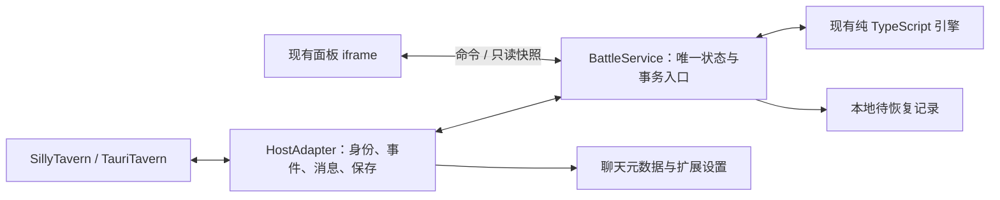

# 战阵原生前端扩展迁移方案

> 许可更新：本文包含 2026-09-19 的迁移与发布历史记录，其中非商业许可及商业付费要求仅描述旧版。自 1.0.0 起，本项目采用 GPL-3.0-only，以仓库根目录 LICENSE 和 LICENSE-NOTES.md 为准。

设计日期：2026-09-19。进度更新：2026-09-20。M0—M4 已完成，原生扩展 0.2.0-rc.1 已通过两宿主隔离验收。详细结果与实测边界见 [验收记录](native-extension-validation.md)，原始 9 月 18 日脚本保持冻结。

目标：在保留当前战斗规则、档案、战报和操作习惯的前提下，使战阵通过 SillyTavern/TauriTavern 原生前端扩展独立运行，并建立可重建的源码发布、可靠的保存与清理语义。原生包的安装、启动和日常使用不依赖酒馆助手；旧数据读取仅作为迁移功能。

## 1. 已确定的设计选择

| 事项 | 本方案决定 | 理由 |
| --- | --- | --- |
| 交付形态 | 原生 UI extension；不增加 Node/Rust 服务端组件 | 复用现有本地引擎，覆盖 SillyTavern 与 TauriTavern |
| 第一版界面 | 保留浮动窗、悬浮球、手机全屏和五个工作区，暂留同源面板 iframe | 控制回归范围，先解决宿主依赖与保存 |
| 状态权威 | 主窗口单一 BattleService；UI 只持有视图、表单草稿和快照 | 避免控制器与面板独立写入同一份事实 |
| 保存位置 | 聊天事实写入 chatMetadata.tavernBattle；全局显示偏好写入 extensionSettings.tavernBattle | 隔离聊天数据，不把全部战报写进全局设置 |
| 存档格式 | 在现有有效存档外加原生容器，不同时重写内部战斗格式 | 保留单位 ID、经验、随机种子、旧规则和结算记录 |
| 数据来源 | 当前聊天的实际数据；导出脚本的 data 字段不是聊天存档 | 用户提供的脚本 data 为空，不能据此推断所有聊天为空 |
| 清理语义 | 明确记录 cleared 状态与数据代次；不按时间戳自动恢复旧镜像 | 尊重已清理的数据 |
| 第一版兼容范围 | 单角色聊天，两种战斗模式；群聊另列后续需求 | 现有 namespace 明确不支持群聊，迁移不扩大业务范围 |
| 性能工作 | 第一版按需打开 UI；完整模块去重、报告分片和 Worker 后续量测决定 | 不把所有优化捆在一次宿主迁移中 |
| 发布策略 | 原生版为后续主线，旧脚本冻结为过渡/回退基线 | 避免长期维护两套行为不同的产品 |

官方原生扩展提供 manifest、上下文、事件、设置与聊天元数据接口；优先通过 getContext 获取能力。[SillyTavern 扩展文档](https://docs.sillytavern.app/for-contributors/writing-extensions/)

TauriTavern 上游说明支持前端扩展，且不支持上游 Node-only 后端插件。本方案不会要求用户额外运行服务器。[TauriTavern 官方说明](https://github.com/Darkatse/TauriTavern/blob/main/README.md)

## 2. 目标架构与职责



### 2.1 主窗口运行服务

以现有 NarrativeController 为起点，不创建第二套独立事实系统。逐步把面板 main.ts 中的战斗推进、结算、保存、自动战斗调度和发送游标纳入 BattleService；现有纯函数继续使用。

所有改变事实的操作走同一命令入口：建档、配装、正文批准、战斗动作、经验结算、删除、重战、数据导入。UI 中的排序展示、地图相机、输入框草稿和当前页签仍为视图状态，无需每次持久化。

关闭面板后，正文事件监听继续工作。全自动战斗沿用现有关闭面板即停止的行为：停止安排下一步，已进入事务的单步完成或保留为待核实状态。切聊天同样停止自动推进，不能把上一聊天任务带到新聊天。

### 2.2 面板连接

第一版采用同源 iframe 与父窗口的固定接口，不引入通用 RPC 框架：

- connect(viewId) 返回协议版本、会话标识、只读快照、订阅与命令函数。
- command 接收明确的业务命令联合类型，不接受任意函数名、代码字符串或直接修改存档的对象引用。
- 快照通过 structuredClone 隔离；命令携带 sessionId、epoch、expectedRevision、operationId。
- 面板关闭时解除该视图订阅；重开连接已有服务，不创建第二个控制器。
- 独立开发预览使用同一协议的本地适配器，不能因父窗口接口缺失就误建真实宿主写入器。

这层 iframe 主要用于保留样式和 UI 生命周期，不能被当作同源脚本的安全边界。后续是否去掉 iframe，以维护收益和性能量测决定。

### 2.3 宿主接口

把当前 inTavern 单一布尔值改成能力表；使用时读取最新上下文，不长期持有全局 chatMetadata 引用。

| 接口责任 | 目标路径 | 约束 |
| --- | --- | --- |
| 当前聊天身份 | getContext 的角色/聊天信息，加会话 epoch | 缺可靠身份时只读，不使用 default 或角色名作为写入键 |
| 消息读取 | 当前 chat 与 swipe 数据 | 明确角色、来源、完成状态；不能把最后一条任意消息当作完整 AI 回复 |
| 事件订阅 | eventSource；兼容 eventTypes / event_types | 返回确实可停止的订阅；启动、停止幂等 |
| 提示投影 | setExtensionPrompt | 固定单一提示 ID；每次替换；切聊天及停用清空 |
| 聊天保存 | 写专用 namespace，再调用宿主保存接口 | 独立验证落盘结果，见第 4 节 |
| 设置保存 | extensionSettings 与宿主设置保存接口 | 只存显示/入口偏好，不存战斗历史 |
| 用户消息发送 | 专用 MessagePort，基于原生 chat、保存、渲染和生成能力 | 不使用文本框点击模拟，不覆盖用户草稿或消耗待发送附件 |
| 旧档读取 | LegacyReader | 只读迁移，不参与原生版日常保存 |

宿主当前源码提供 eventTypes 和旧名 event_types，并暴露 chat、saveMetadata、saveChat、addOneMessage、generate 等能力；没有必要把整个 TavernHelper 对象搬进原生包。[原生上下文源码](https://raw.githubusercontent.com/SillyTavern/SillyTavern/release/public/scripts/st-context.js)

新 hooks 只能作为已验证版本的增强路径。基本启动/清理必须有能力探测和幂等入口，不能假定用户安装版本与上游最新版本完全一致。Tauri 的少量差异集中在一个宿主模块，不散落到引擎或视图中。

## 3. 源码对齐：迁移前置阶段 M0

本阶段开始时 sourceStatus 为 artifact-only，新版成品无法由原有 TypeScript 源码重建。2026-09-20 已完成对齐，并保存当时的独立重建产物和对照证据。后续原生迁移有意改变异步 UI 调用链；初始 M0 模块等价报告作为历史基线保留，当前候选使用固定种子引擎对照、冻结旧版恢复验证及原生回归检查，不把已改变的 UI 声称为逐模块完全相同。

实施步骤：

1. 固定当前 JSON、提取面板和控制器的哈希；建立可追溯的源码版本基线。
2. 优先使用产生新版的源代码。若无法取得，根据新版中的模块注册表、导入关系、导出符号和现有目录做静态映射，将实际差异恢复到对应源码；不把整个编译 bundle 包成一个难以维护的源文件。
3. 对齐重点包括：五技能槽、装备默认值、长兵器/濒死占格/重整修订、坏档处理、升级冷却、自动暂停与记录入口、武器本名和技能减员显示。以真实成品行为为依据，版本说明只作为核对线索。
4. 从最新版成品提取合成样例的基准输出，在相同随机种子与操作序列下比较重建版。跨编译方式不要求二进制相同；要求数值、事件、存档、显示语义一致。
5. 确认等价后更新版本元数据、源码指纹和构建状态；保留原始 JSON 作为对照样本。

M0 完成标准：新版特有变更都有源码对应位置；关键场景对照通过；可从源码构建候选；构建不会覆盖冻结输入。涉及旧 V2/V3/V4 战斗的规则版本保留，不借宿主迁移强制升级战斗公式。

## 4. 保存模型与异步事务

### 4.1 容器结构

以下为设计类型，尚未写入真实存档：

```ts
interface NativeEnvelope {
  format: 'tavern-battle-native';
  containerVersion: 1;             // 与 payload 内部 schemaVersion、rulesVersion 分开
  documentId: string;              // 插件存档身份，首次初始化生成
  generation: string;              // 清理/显式替换时更换的数据代次
  revision: number;                // 同一代次内递增，不用时钟决定新旧
  state: 'active' | 'cleared';
  lastOperationId: string;
  payloadHash: string;
  payload: ExistingPanelSave | null;
  migration?: {
    source: 'helper-chat' | 'explicit-file' | 'empty';
    sourceHash: string;
    legacyNamespace?: string;
  };
}
```

payload 保存当前已验证的业务存档，保留可兼容未知字段；元数据 envelope 不改变单位与技能的实例 ID。个体生命、编队成员生命、经验、库存实物、技能冷却、效果期限、战斗 RNG 状态、报告、发送游标、已提交战果和正文去重凭据均需保留。

全局设置只保存面板主题、入口位置等偏好。剧情同步开关、发送范围与自定义提示词仍随当前聊天，不在迁移中改成全局设置。第一版历史战报继续包含在 payload 内，保持随聊天导出；大报告外置属于后续存储改造。

运行时身份包含用户作用域、角色稳定标识、宿主聊天标识及会话 epoch。角色数组序号仅用于读取，不能作为持久身份。聊天改名更新存储定位；分支/复制聊天建立新的可写会话，保留继承历史的去重语义。documentId 不是单独的全局写入锁，复制元数据不能导致两个聊天共用写入队列。

### 4.2 保存不能只依赖 await

本次核对发现：上游 saveMetadata 调用 saveChatConditional，后者在部分等待超时或异常路径记录日志后正常返回。因此 Promise resolve 和内存读回均不是可靠的落盘证明。[保存实现源码](https://raw.githubusercontent.com/SillyTavern/SillyTavern/release/public/script.js)

StoragePort 的结果明确区分：

| 结果 | 含义 | 后续行为 |
| --- | --- | --- |
| confirmed | 独立持久化读回匹配当前代次、revision、operationId 和 hash | 发布已确认状态，允许下一条事实命令 |
| pending | 已暂存候选，但宿主持久化结果未能确认 | 保留待恢复记录，暂停依赖该结果的推进与发送 |
| conflict | 目标身份、代次或预期 revision 已变 | 重新载入并使旧意图失效，不覆盖新状态 |
| failed | 候选或恢复记录未能保存，操作不能继续 | 保留上一已确认状态并报告失败 |

第一版流程：

1. 在当前聊天队列中验证命令身份、代次和预期 revision。
2. 在候选快照上计算结果，保留上一已确认快照；不能边修改权威对象边 await。
3. 将候选及 operationId 写入可确认的本地待恢复记录，优先 IndexedDB。无法保留恢复记录时，停止提交并保持原状态。
4. 再核对当前宿主身份，只替换当前捕获 metadata 对象内的 tavernBattle 键，保留其他扩展的数据，然后请求保存。
5. 通过已验证的宿主读取路径，按原目标聊天身份独立读回持久化内容。SillyTavern 可验证现有聊天读取 API；TauriTavern 必须实测其兼容路径。独立读取只能用于核验，不直接用旧整份聊天覆盖宿主。
6. 确认成功后发布新快照、更新事实投影并清除待恢复记录；无法确认则维持 pending，不能将“没有抛异常”显示为“保存成功”。

实际保存 API 可能在内部等待后才读取当前聊天。切聊天后，旧任务不能继续操作新上下文；对原目标的读回失败意味着旧提交仍需核实。只有操作开始、阶段间和完成后都校验身份，并保留恢复记录，才能处理这类竞争，单纯保存一个 chatId 字符串不够。

待恢复记录不参与“时间戳更大就获胜”的自动选档。返回原聊天后，先核对宿主持久状态和代次：已存在 operationId 则完成确认；同代次且前置版本未变才可重新提交；出现清理标记、更新版本或身份变化则停止自动恢复。

第一版每个业务操作提交一次；相机、悬停、切页等展示动作不写聊天。全自动连续执行也必须等待上一条事务确认，不通过批量跳过保存来取得表面性能收益。

不宣称原生前端能提供后端数据库级 CAS。第一版支持单个可写实例；多标签页通过支持的浏览器锁能力互斥，没有可靠互斥能力时不给出多窗口并发写入保证。冲突检测负责拒绝覆盖，不能冒充分布式原子提交。

### 4.3 改造范围

当前同步 SaveReceipt 调用链必须整体适配，不能只把 adapter.save 加上 async：

- NarrativeController 的 write、persistPanel、approve、库存事务、删除/恢复、迁移与战报重战等返回 Promise。
- main.ts 中依赖 persist(): boolean 的流程改为等待命令完成，移除未确认即推进、关窗或发送的路径。
- 战斗执行器在候选实例上运行；失败恢复 RNG、动作点、日志及战果凭据，不能只恢复血量。
- 保存未确认时，视图可显示待核实结果，但模型事实投影及下一笔结算使用最后确认版本。

## 5. 旧数据迁移与清理规则

酒馆助手当前实现把 chat 变量放在 chat_metadata.variables，战阵旧适配器读写其中的 panel。因此经过版本和形状校验后，原生迁移器可读取 chatMetadata.variables.panel；助手停用后，旧聊天数据仍可由原生宿主读取。实际安装版本须在 M1 验证，不扩展扫描其他变量或角色库。[助手变量源码](https://raw.githubusercontent.com/N0VI028/JS-Slash-Runner/main/src/function/variables.ts)

### 5.1 迁移决策表

| 当前状态 | 处理 |
| --- | --- |
| 已有有效原生存档 | 使用原生存档，忽略旧镜像 |
| 原生 state=cleared | 当前为空；不导入旧变量或旧备份 |
| 没有原生存档，有有效当前聊天旧档 | 预览实际条目与来源后一次性采用；用户也可选择从空状态开始 |
| 没有原生存档，当前聊天旧档为空或不存在 | 初始化空容器并记录 empty 来源，不扫描本地备份补回 |
| 旧档坏项、身份不符、仅存在镜像或多个来源冲突 | 不自动覆盖；显示明确的待核对来源或显式文件导入入口 |
| 未知未来 containerVersion | 只读并支持导出原数据，不能按当前默认值重写 |

用户已经清理过的数据不能通过仓库历史包、角色级变量、localStorage 的较高时间戳或自动历史扫描重新补入。这里的清理策略是本次明确设计，不需要把“清理过”误解为必须删除所有仍有价值的旧聊天。

### 5.2 一次性导入事务

只针对当前聊天：读取并复制源 → 校验与摘要 → 生成保持规则版本的候选 → 保存原始来源备份并验证可恢复 → 使用第 4 节事务写入原生键与迁移凭据 → 独立读回验证。任何阶段失败都不删除源数据，不写“迁移完成”。

源备份放在按聊天隔离的本地恢复区并提供导出，不嵌入每次保存的全局设置，也不无限叠加进 payload。旧变量在第一版保留为冻结来源，不再双写；显式文件导入才允许采用外部存档。

迁移同时保留旧 namespace、已提交来源键、战果 ID、库存操作记录、发送游标和删除回执。原生消息标识更换时需维护旧键映射，不能因为换了 namespace 就把同一历史标签重新执行一次。无法可靠对应的历史消息仅供手动预览，不批量重扫后自动提交。

清理当前聊天时生成新 generation，写入 cleared 容器或明确的空新状态；旧代次本地记录均失去恢复资格。清理完成以宿主确认结果为准。单纯删除某个 localStorage 键不是清理事务。

### 5.3 旧脚本与新扩展互斥

原生服务使用新的全局名称，不能占用旧 __tavernBattleController；旧脚本启动时会处置该名称下的实例。

检测到旧运行器时，新扩展进入待切换状态，不注册会写事实的流程。用户只需停用旧“战阵”脚本并刷新，其他依赖酒馆助手的角色卡仍可继续使用助手。卸载整个助手不是迁移前提。

每次提交也检查冲突。仅调用旧 controller.dispose()、移除 DOM 或设置双方未共同遵守的标志位，都不能证明旧脚本已经停用。旧脚本不支持新锁协议，因此不允许两者同时作为写入器运行。

## 6. 消息、事件与提示词行为

### 6.1 发送流程

使用结构化消息对象和专用 MessagePort：生成一次 deliveryId → 校验聊天/事实版本 → 插入一条明确的 user 消息并记录投递身份 → 保存并核实 → 按宿主约定发送消息事件、渲染 → 在用户请求发送给 AI 时触发一次普通生成。

消息使用当前 getContext 暴露的 chat、addOneMessage、eventSource、generate 等能力组合实现。源码核对发现，normal + automatic_trigger 仍会处理、清空草稿；原生版只在末条仍是刚保存的本次 user 消息时使用 regenerate 路径，跳过草稿命令、清空和附件逻辑，也不会删除已有 assistant 回复。实机仍须验证该路径。不能把字符串拼成 slash command 执行，也不能把 chat.push 本身当作完整发送。

每个异步边界重新核对发送目标。消息已经进入原聊天但用户随后切换时，停止后续自动生成，按真实结果标记已插入/待核实；不能在新聊天里触发旧战报的生成。新增投递记录与消息尽量由同一宿主保存覆盖，外部生成仍作为单独的可核实步骤，不能宣称两者是一个原子事务。

保留 sent / inserted / copied / unknown / failed 等交付语义；另外记录消息是否落盘和生成是否开始。消息已插入而生成失败时，只允许重试生成，不重复插入。网络结果不明时查 deliveryId，不能为了“保险”再发一遍。报告游标仅按验证过的投递状态推进。

不直接套用会消费输入框附件的宿主发送函数。验收必须包含输入框已有文字和待发送附件的情况；战报发送不得修改或消费这些内容。

### 6.2 事件处理

| 事件/场景 | 行为 |
| --- | --- |
| 生成前 | 捕获会话与事实版本，刷新已确认投影；dry-run 不启动事务 |
| 收到消息 | 记录消息身份；流式未完成时不提交半截协议 |
| 结束/停止 | 结合消息身份、生成会话及完整性判断，失败或中止不假定成功 |
| 编辑 / swipe | 更新候选；已经提交过的历史来源不再次授予战果或物品 |
| 删除消息 | 撤销未提交候选并维护索引映射；不自动回滚已经发生的战斗 |
| 切聊天 / 分支 | 递增 epoch，停止旧自动流程，清提示与预览，再载入新状态 |
| 停用 / 重载 | 注销全部事件、提示、计时器和视图连接；再次启动不重复绑定 |

优先保留现有生成前事件与 setExtensionPrompt 路径，不为了原生形态额外叠加第二套拦截器。若实测某支持版本需要 generate_interceptor，按能力选择唯一投影入口，不重复注入。

消息数组下标可能随删楼层改变，不能单独承担长期身份。新消息使用稳定的插件消息标识或经过验证的宿主标识；添加消息标识与提交记录放在同一次保存中。旧来源映射遵循第 5 节，正文或时间相同但身份有歧义时不得自动合并。

### 6.3 世界书和正则

第一版继续随包提供现有世界书与可选折叠正则。世界书维持用户编辑内容及触发设置，不自动写入另一份相同规则，也不把所有世界书规则再塞进扩展提示。若以后提供安装/更新按钮，应比较内容并展示差异。

正文协议、确认规则和用户自定义提示词沿用新版行为；不增加模型调用。token 优化在功能一致后单独测量最终请求，不能用 JS 包体缩小作为 token 改善证据。

## 7. 文件改造与构建发布

维持一个 TypeScript/Vite 仓库，不拆成多个独立 npm 包。建议目录如下，均为未来实施目标：

```text
engine/src/                   保留纯计算与版本规则
runtime/src/
  battle-service.ts            单一命令入口与状态快照
  command-queue.ts             顺序、operationId、epoch 校验
  save-envelope.ts            原生容器与版本校验
  recovery-journal.ts          待恢复记录
  legacy-import.ts             当前聊天旧档迁移
host/src/
  contracts.ts                HostAdapter / StoragePort / MessagePort
  sillytavern.ts               公共能力适配
  tauritavern.ts               经验证的宿主差异
  memory.ts                   独立开发与合成测试
extension/
  manifest.json               入口、版本与最低支持版本
  src/index.ts                启停、入口按钮、设置注册
  src/panel-host.ts           按需创建 iframe 与视图连接
panel/src/                    保留视图，逐步移除直接宿主写入
release/native-candidate/     独立原生构建产物
```

| 当前文件 | 改造责任 |
| --- | --- |
| panel/src/tavern.ts | 拆出宿主接口与旧档读取；取消助手存在性决定全部能力的逻辑 |
| panel/src/controller-entry.ts | 由原生入口启动同一个服务；移除对助手脚本 iframe 生命周期的依赖 |
| panel/src/narrative-controller.ts | 异步事务、事件订阅、投影，逐步纳入 BattleService |
| panel/src/main.ts | 分离视图状态与业务命令，改造所有同步 persist 调用 |
| panel/src/battle-execution.ts、auto-battle.ts | 将推进/自动循环与视图卸载分离，保留既有暂停语义 |
| panel/src/narrative-state.ts、storage-codec.ts | 复用协议事务和旧镜像解码；不把镜像设为新版权威来源 |
| scripts/loader.template.js、pack-loader.mjs | 保留旧脚本路线，不作为原生包运行入口 |
| panel/vite.config.ts、controller.vite.config.ts | 旧输出冻结；新增原生构建配置与独立输出目录 |
| scripts/loader-smoke.mjs 等 | 保留基线证据，增加针对原生接口和数据切换的相关验收 |

原生发行根目录包含 manifest.json、入口 JS、面板 HTML、所需静态文件、说明及构建清单。资源使用相对入口 URL，不能依赖某个固定安装目录名或远端 CDN。manifest 的作者、仓库和最低版本必须使用实际确认信息，不能填假兼容版本。

新增 build:extension / verify:extension 路线，构建写入 native-candidate，不覆盖 panel/dist 基线。依赖图检查应排除原生运行包中的 TavernHelper 调用、远程脚本依赖和未打包 TS 文件；LegacyReader 对旧字段的只读支持不算运行依赖。

源码提交/版本号、源码指纹、产物哈希和验收结果关联保存。第一版以手动可控更新发布，不因发现更新自动迁移存档。扩展管理只是分发方式，不能代替数据迁移事务。

## 8. 实施阶段、验收与回退

依赖顺序：M0 → M1 → M2 → M3 → M4。M5 是后续优化，不作为第一版独立运行的前置条件。

| 阶段 | 工作与交付物 | 完成标准 | 工作量重点 |
| --- | --- | --- | --- |
| M0 源码对齐 | 新版差异清单、恢复源码、基线对照、独立候选构建 | 新版功能可重建，规则/存档关键输出一致 | 中到大，取决于新版原源码是否可获得 |
| M1 宿主原型 | 两宿主能力报告、消息发送原型、持久化读回验证、旧字段读取验证 | 助手完全停用时读/写/发/注入可工作；草稿附件不受影响；保存失败能识别 | 中，先消除 API 假设 |
| M2 状态事务 | BattleService、异步命令、恢复记录、面板连接 | 所有事实写入统一；延迟、失败、重试、切聊天不串档或重复结算 | 大，是主要工程量 |
| M3 原生包与迁移 | manifest、原生构建、入口/设置、逐聊天迁移、互斥与回退导出 | 可安装；无助手可用；数据清理不被镜像撤销；迁移失败保留原档 | 中 |
| M4 验收与发布候选 | 功能对照、真实宿主报告、已测版本表、发行文件 | 必需用例全部通过，产品行为与冻结基线对应 | 中，不以模拟宿主冒充实机 |
| M5 按测量优化 | 引擎按需加载、模块去重、报告访问优化、必要时 Worker | 数值一致，性能数据证明改善 | 独立安排 |

M1 完成前不承诺“await 即持久化”或“关闭助手就完全兼容”。支持版本表记录实测的 SillyTavern、TauriTavern、桌面 WebView 和移动环境；未测试的平台不列为已验证。

### 8.1 必需验收集合

1. **依赖**：TavernHelper 不存在，原生扩展仍能启动、加载档案、操作战斗、注入事实和发送战报；卸载/重载没有残留监听。
2. **源码与引擎**：相同 RNG 状态和操作序列，小战/会战数值与基线一致；旧规则快照可恢复；生命、经验、冷却和效果期限不会因迁移重算。
3. **保存**：正常、慢保存、超时但实际成功、真正失败、等待期间切聊天、刷新恢复均能区分；不会因重试重复扣物品、授经验或提交战果。
4. **数据**：非空旧档、真正空档、cleared 标记、较新的旧镜像、坏档、未知版本分别符合决策表；清理后刷新不会复活旧内容。
5. **消息**：普通生成、继续、重生成、swipe、停止、编辑、删楼层各自验证；迁移前提交过的标签不会重复入账。
6. **投递**：发送一次只有一条消息；生成失败可单独重试；结果不明不重复发送；草稿、附件和历史战报游标语义正确。
7. **界面**：桌面浮动窗、390px 手机全屏、悬浮球、关闭重开、页面草稿保留；关面板正文联动继续、全自动按原规则暂停。
8. **切换与回退**：旧脚本仍开启时原生版不写；迁移中断可重新核实；回退包含原生阶段产生的新进度。

测试使用合成档案和固定种子。只运行与迁移相关的回归，不为宿主迁移追加大批量平衡模拟，也不把旧源码用例通过当成新版成品等价证明。

### 8.2 性能验收方法

在相同设备、相同聊天和档案下比较冻结脚本与原生候选：关闭面板启动耗时、首次打开耗时、100 次开关后的订阅/计时器数量、空闲轮询、保存耗时、长战报页响应和请求 token。

第一版硬性目标是无监听累积、关闭面板不持续重复加载 UI、展示操作不写全量存档、事实一致。尚无测量数据，不预先承诺“快 50%”或某个绝对内存数字；性能退化须定位并有明确处置后才发布。

### 8.3 回退策略

- **尚未产生原生新进度**：停用原生扩展，保留迁移前源备份，重新启用冻结脚本。
- **已经产生原生新进度**：先导出当前 payload 和原生 envelope。必须通过预先验证的兼容导出转换，将最新状态交给旧脚本；不能直接恢复迁移前备份而丢弃之后的战斗。
- **旧版无法表达新状态**：回退到上一个兼容的原生版本，或只读保留并导出；不静默丢字段、不自动降级规则。
- 回退同样只允许一个写入器；清理状态及对应聊天的旧镜像必须遵守代次边界，不因切回旧程序而自动恢复已删除内容。

旧脚本不认识原生 generation，不能指望它自行遵守新清理标记。兼容回退工具必须将最新转换结果同步到该聊天的旧变量与已确认归属的旧镜像键，或明确隔离该键，再允许旧脚本启动；cleared 状态转换为验证过的旧版空存档。不会扫描或清除其他聊天的缓存。无法确认旧键归属或空档行为时，不执行自动回退写入。

## 9. 第一轮实施任务清单

按以下顺序逐项交付；进行状态随实施更新。

- [x] M0-1 建立新版模块到源码的差异映射；控制器 84、面板 103 个模块均已对应。
- [x] M0-2 源码对齐、类型检查、固定种子对照、独立构建及候选加载器冒烟验证通过；22 项遗留测试失败在原始成品中完全复现，记录在 artifacts/migration-m0/legacy-tests.json。
- [x] M1-1 SillyTavern 1.19.0 与 TauriTavern 2.1.0 的原生接口、正式候选及仓库安装布局验收通过。
- [x] M1-2 Tauri 保存有独立读回证据；延迟、吞错、落盘后抛错、切聊天与恢复队列已有针对性测试。
- [x] M1-3 两宿主真实生成、完整回复持久化、结构化消息、草稿和待发附件隔离验证通过，使用本地测试模型。
- [x] M2-1 存档类型、HostAdapter、单一异步存储队列、恢复日志和 BattleService 已实现。
- [x] M2-2 面板同步保存调用链已改为 await；库存、正文批准、报告、战斗候选通过同一权威存档提交，未确认不发布新事实。
- [x] M2-3 原面板已接通；浏览器验收覆盖关闭重开、草稿保留、100 次开关、全自动关闭暂停和 390px 窄屏。
- [x] M3-1 原生构建、按需入口、存档管理、旧运行器冲突、Web Locks、显示偏好和可安装发行包完成。
- [x] M3-2 当前聊天导入、原档备份、cleared 代次、消息稳定 ID 和旧已提交来源映射已实现，并有针对性测试。
- [x] M3-3 文件导入、最新进度兼容导出、旧变量/明确归属镜像交接、重新迁回已实现；冻结 9 月 18 日控制器及两种引擎成功恢复最新原生进度，见 artifacts/migration-m3/frozen-rollback.json。实机流程继续由 M4 覆盖。
- [x] M4-1 54 项专项测试、22 个浏览器流程检查及两宿主验收通过；完整历史测试 689 通过、22 项已知旧断言失败，无新增失败。
- [x] 发布：根安装入口、配套资源、说明、校验清单和非商业许可证完成；公开仓库 https://github.com/smokycamera/tavern-battle，版本 0.2.0-rc.1。

实施只使用项目源码、合成测试和独立便携酒馆数据目录，尚未迁移用户的真实聊天。用户已授权最终发布公开 GitHub 仓库；许可证署名及商业授权方为 smokycamera，非商业使用允许，商业使用需事先书面授权并按约定付费。当前基线与初步评估分别见 [替换记录](script-baseline-20260919.md) 和 [迁移评估](extension-migration-assessment-20260919.md)。
