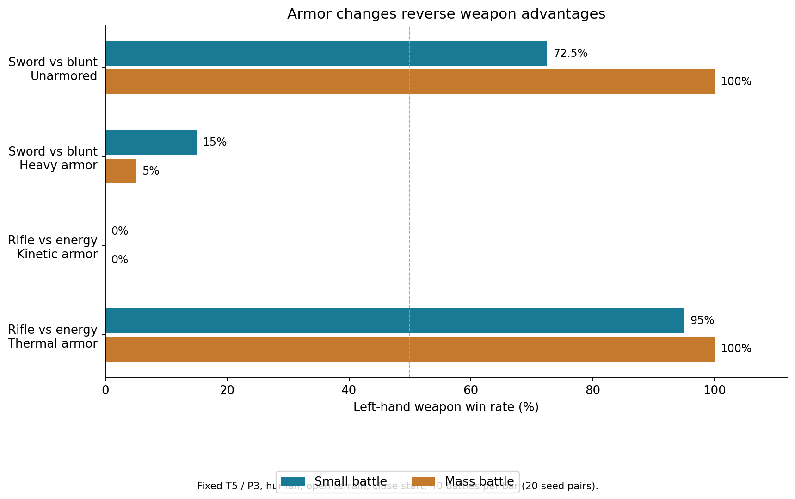
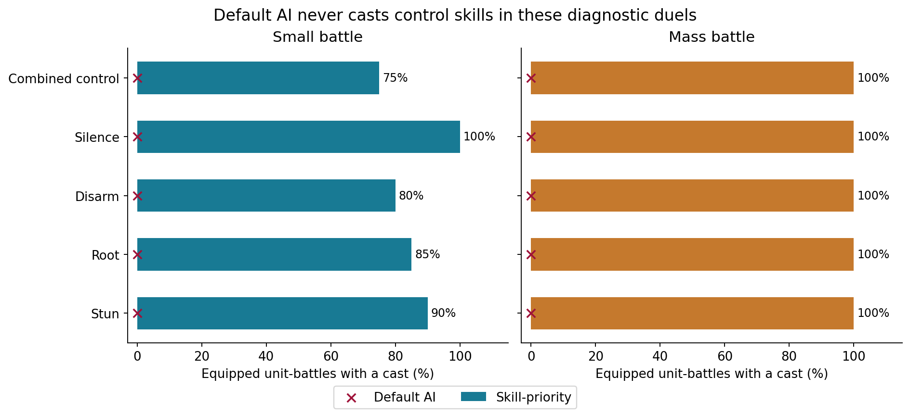
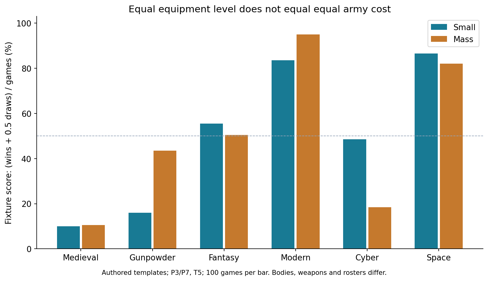

# 2,800 场战斗平衡与差异性审计

**结论：武器与防护通道已经表现出明确的克制差异，但目前不能判定整个系统都已平衡。最明显的待改进项是纯控制技能在默认 AI 中几乎没有出场机会，以及跨世界观缺少统一的阵容成本口径。**

测试基线：`86d719dc4931a77d99ddd0ee19638d81c0eaefb2`，即包含上一轮平衡修正的主分支。全程使用真实 V4 战斗执行器；未把公式预览、试跑或重复复现计入场数。本轮只新增审计脚本、数据分析与报告，没有调整引擎数值。

## 数量与覆盖

|测试部分|小规模|会战|合计|用途|
|---|---:|---:|---:|---|
|同世界观|300|300|600|同一设定下不同阵容与训练等级|
|跨世界观·统一装备等级|300|300|600|P3/P7、T5下的机制差异|
|跨世界观·各自科技等级|150|150|300|保留模板P2–P8科技代差|
|武器、技能、配件等机制对照|250|250|500|25类对照|
|技能策略诊断|240|240|480|默认AI与合法技能优先策略|
|护甲单变量对照|160|160|320|固定T5/P3，只改变防护|
|**合计**|**1,400**|**1,400**|**2,800**|全部达到引擎终局|

覆盖角色训练1–10级、装备1–10级、全部17类武器、4种身体/平台、7类配件、7类消耗品；会战单编队30/50/100人或载具。主矩阵以3对3为主，机制对照为1对1；包含副武器、盾牌、骑乘、飞行、召唤及范围效果。

六种世界观是**本次编写的引擎模板**：中世纪武侠、火药蒸汽、高魔奇幻、现代军事、赛博异能、星际战争，不代表任何作品的官方强度。六类场景为平原、密林、山地、城镇、夜间密林和攻城。小规模使用实际地图与占点目标；会战使用环境标签与阵位，不执行格子占点规则。

42种技能配置进入主矩阵，其中35种被默认AI实际施放；加上策略诊断，**39种得到实际施放覆盖**。纯净化、纯回能、纯恐惧技能仍未得到成功使用覆盖，不能宣称已验证全部技能组合。

## 一、已证实的武器差异

为避免主矩阵不同等级产生混淆，额外320场固定了T5/P3、人类、开阔近距、无技能无配件；会战固定50人。下表每格40场，20个随机种子并交换双方与输入顺序。

|对照|小规模左侧胜率|会战左侧胜率|解释|
|---|---:|---:|---|
|剑 vs 钝器，双方无甲|72.5%（29/40）|100%（40/40）|剑有明显优势|
|剑 vs 钝器，双方重甲|15%（6/40）|5%（2/40）|换成重甲后，钝器反超|
|步枪 vs 能量，双方动能特化甲|0%（0/40）|0%（0/40）|能量伤害绕开对动能的重点防护|
|步枪 vs 能量，双方热能特化甲|95%（38/40）|100%（40/40）|只改防护通道，优势反转|



这些反转支持“武器有明确适用场景”，也提示防护通道的克制可能很硬：本组出现0%–100%结果。是否需要软化这种克制属于设计目标选择，不能把所有胜率都调到50%。单一站位与对手类型下的结果也不能推广成全局武器排名。

其他主矩阵观察：P7重甲对射中，单发重步枪对步枪在小规模赢6/10、会战赢10/10；夜视配件在夜间密林对照中两种模式均赢10/10。盾牌、骑射、飞行的单挑对照没有显示稳定优势，尚不足以证明其在护卫、占点、绕行或协同战术中的价值。

## 二、技能差异的主要瓶颈在 AI 选择

主矩阵中，纯眩晕、纯缴械、纯沉默、复合眩晕控制都没有被默认AI施放。对应的480场策略诊断进一步确认：技能并非无法执行，改用合法时优先施放后能正常使用；默认AI在这些控制单挑中仍为零次。

|技能|默认AI实际施放次数，小规模/会战|技能优先策略实际施放次数，小规模/会战|
|---|---:|---:|
|眩晕|0 / 0|36 / 176|
|定身|0 / 0|17 / 120|
|缴械|0 / 0|16 / 136|
|沉默|0 / 0|20 / 128|
|眩晕+缴械+沉默|0 / 0|15 / 60|



代码提供了一个直接线索：`engine/src/skill-effects.ts` 的 `skillEffectValue()` 对眩晕/定身使用约5的基础效用，其他状态约2，再乘生效机会；攻击候选则按预期生命损失评分。会战伤害随参与人数放大后，固定状态分值更难竞争。这支持优先检查AI效用量纲与情景判断，**尚不能证明提高控制评分就一定改善胜率**。

优先施放也不是最优战术：在小规模眩晕对定身中，两种策略都是10胜10负；会战缴械对沉默由默认AI的8胜10负2平变成14胜6负。沉默应克制施法，缴械应克制武器，定身应影响机动；本次一对一近距法杖对抗不足以充分展示这些角色定位。

盾击对近战伤害技能的诊断中，小规模为6胜14负，会战为6胜12负2平，两种策略结果相同。当前样本支持“盾击在近距伤害竞争中处于劣势”，尚缺少其独有控制、护卫或生存收益的反向优势案例。

治疗+屏障在部分诊断中优于纯治疗，但样本仅每模式每策略20场；持续治疗还会延长战斗。暂不据此继续增削数值。

## 三、跨世界观：科技等级与阵容成本需要分开

保留各模板科技等级时，高P一方在小规模赢147/150（98%），会战赢142/150（94.7%，另4场平局）。T8/P2对T2/P5的单挑对照，低训练高装备方两种模式均赢10/10。训练无法轻易弥补本组装备代差，这是本引擎当前非常鲜明的设定。

统一P后，现代与星际模板仍明显领先。例如现代模板在等P跨世界观中，小规模83胜1平/100场，会战94胜2平/100场。但这些阵容包含载具、炮火和不同体型；**同P并非等成本**，不能把该结果直接当成载具或步枪必然超模的证明。



若产品目标是跨世界观公平竞技，建议下一步先定义统一的队伍预算：人数、平台体量、机动、射程、范围火力、技能与消耗品都需要占预算。否则“3名步兵 vs 3台平台”即使装备等级相同，也不是公平对照。若目标是忠实呈现科技代差，则应保留原生P层并明确告知预期压制程度。

## 四、等级、战斗时长与平局

2,800场中2,626场分出胜负，174场平局（6.21%）。其中147场为到期平局，27场为其他引擎平局；另有9场在期限边界附近分出胜负。不要把“达到期限”与“平局”混为一谈。全体平均观察轮数12.82，90%分位32轮；这包含到期截尾，**不是自然结束时间的无偏估计**。

主矩阵同世界观会战平局75/300（25%），比其他大组更突出。主矩阵等级分层如下，每级每模式60场，阵容固定且武器P取各世界模板的固定值：

|训练等级|小规模平均轮数|会战平均轮数|会战平局|
|---|---:|---:|---:|
|T1|10.2|12.5|6/60|
|T3|11.3|19.5|18/60|
|T5|13.6|19.4|14/60|
|T8|15.1|22.4|17/60|
|T10|13.8|24.0|20/60|

固定武器P下高训练会战更容易拖长，应继续区分护甲穿透不足、持续恢复、士气与AI推进造成的僵持。当前不建议仅延长40轮期限来掩盖问题。

## 五、后续调整顺序

1. **先改善AI对控制的估值。** 用预计阻止的伤害/行动、能否打断施法、是否妨碍占点、状态重复和实际持续时间估值；保留SP与占用行动的成本。验收不能只看施放次数，还要与普攻、其他控制在适用目标下比较。
2. **建立等预算跨世界观组。** 当前等P组用于观察机制，不能担任公平竞技平衡的最终验收。
3. **补齐弱覆盖定位。** 盾击、纯净化、回能、恐惧、骑射、飞行应在护卫、状态解除、资源枯竭、士气与机动任务中体现收益；当前缺少这些收益证据。
4. **定位高训练会战的到期来源。** 以伤害、恢复、移动和士气日志拆解，不把到期平局算作平衡达标。
5. **保留已经成立的克制关系。** 剑与钝器、动能与能量的反转已明确出现；若调整，先规定希望保留多强的克制幅度。

## 数据、复现与限制

- [完整逐组统计](statistics.md)含200个主矩阵单元、策略与护甲对照、逐技能使用表和描述性配对区间；[机器可读汇总](summary.json)；[复现核验记录](verification.json)。
- 数据包保留全部2,800场的逐场结果、初始战斗快照、完整日志、配装清单和文件校验值。抽取16场重新执行，初始配置、终态、胜负、轮数、技能使用与去时间戳日志哈希全部一致，复现的16场不重复计数。
- 发现原始输出中7条记录缺失后，用原种子补跑；最终按唯一比赛ID计数，2,800条结果与2,800份日志严格对应。没有把进度计数或失败/缺失记录算作完成场次。
- 审计脚本通过独立TypeScript检查；未重新运行整套引擎单元测试。本轮引擎源码未变，源码SHA256为 `194da2d029093a45f4973364d7b6e62f472abf2b81644805bb8bc8170ec74c39`。
- 主矩阵每单元只有5个种子及阵营交换，交换结果有相关性；会战500对中494对交换后胜负相同，小规模500对中331对相同。分层配对bootstrap区间仅描述当前模板与种子，不涵盖未测阵容，也不应把退化的0–0/100–100区间当作绝对确定。
- 本次是V4本地AI引擎测试，未覆盖JEV/LLM决策、真人最优战术、所有技能组合、超大阵容或客户端UI。

在包含这些脚本且引擎源码指纹一致的检出中安装依赖后，可顺序执行：

```bash
node_modules/.bin/vite-node scripts/sim-worldview-matrix.ts --output=engine/sim/out/worldview-2000
node_modules/.bin/vite-node scripts/sim-skill-policy-audit.ts --worker=0
node_modules/.bin/vite-node scripts/sim-skill-policy-audit.ts --worker=1
node_modules/.bin/vite-node scripts/sim-armor-counterfactual.ts
python scripts/analyze-worldview-matrix.py
python scripts/plot-worldview-audit.py
```

主矩阵支持`--workers=N --worker=K`分片；默认单进程生成全部2,000场。脚本支持按唯一ID续跑，检测到执行器源码或审计脚本变化会拒绝混入已有主数据。开始不同版本的比较前，请使用独立输出目录并相应调整分析输入。
